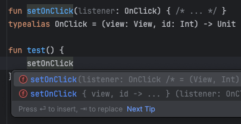

많은 언어들은 함수 타입의 개념을 가지고 있지 않다. 대신에 단일 메서드를 가진 인터페이스를 사용한다.  
이러한 인터페이스들을 'Single Abstract Method'라고 부른다.

아래는 'Click' 이벤트에 대한 콜백을 전달하기 위한 'Single Abstract Method'의 예시이다.

```kotlin
interface OnClick {
    fun clicked(view: View)
}
```

만약 함수가 'Single Abstract Method'를 요구하면, 'Single Abstract Method'를 구현하는 'object' 인스턴스를 전달해야 한다.

```kotlin
fun setOnClick(listener: OnClick) { /* ... */ }

setOnClick(object : OnClick {
    override fun clicked(view: View) {
        TODO("Not yet implemented")
    }
})
```

하지만, 파라미터를 'Single Abstract Method' 대신 함수 타입으로 선언하면 여러 방법으로 파라미터를 전달할 수 있는 유연성을 얻는다.

```kotlin
fun setOnClick(listener: (View) -> Unit) { /* ... */ }
```

```kotlin
setOnClick { view -> /* ... */ }                // lambda expressions
setOnClick(fun(view: View) { /* ... */ })       // anonymous functions
setOnClick(::handleClick)                       // function references
setOnClick(this::showUsers)                     // bounded function references

class ClickListener : (View) -> Unit {          // 선언된 함수 타입을 구현하는 객체
    override fun invoke(view: View) {
        // ...
    }
}

setOnClick(ClickListener())
```

이처럼 함수 타입은 더 넓은 'use-case'를 커버할 수 있다.

그럼에도, 'Single Abstract Method'의 장점 중 하나는 메서드 자체와 그 메서드의 파라미터 이름이 명확하게 지정되어 있다는 것이다.  
이 또한 역시, 함수 타입은 `typealias`를 사용하여 함수 타입에 이름을 부여할 수 있다.

```kotlin
typealias OnClick = (View) -> Unit
```

또한, 파라미터에 이름을 지정하면, 다음과 같이 IDE에서 기본적으로 제안 받을 수 있다.

```kotlin
fun setOnClick(listener: OnClick) { /* ... */ }
typealias OnClick = (view: View) -> Unit
```



람다 표현식을 사용하면, 코드 내 인자들을 간편하게 'destructuring' 할 수 있어, 각 인자를 명확하고 간결하게 다룰 수 있다.  
또한, 함수 타입을 사용하면 개발자는 여러 'Observer'를 각각의 독립된 함수로 설정할 수 있다.  
이는 전통적인 'Single Abstract Method'를 사용하는 방식보다 훨씬 더 유연하고 간결하다.

```kotlin
// Java - Single Listener Interface
class CalendarView {
    var listener: Listener? = null

    interface Listener {
        fun onDateSelected(date: LocalDate)
        fun onPageChanged(date: LocalDate)
    }
}

// Kotlion - Function Type
class CalendarView {
    var onDateSelected: ((LocalDate) -> Unit)? = null
    var onPageChanged: ((LocalDate) -> Unit)? = null
}
```

위와 같은 방법을 사용하면, 'onDateSelected'와 'onPageChanged'의 구현이 인터페이스에 묶여 있을 필요 없이, 독립적으로 변경될 수 있습니다.  
이러한 이유로, 인터페이스를 정의할 타당한 이유가 없다면, 함수 타입 사용을 선호하는 것이 좋다.

---

## When should we prefer a SAM?

Kotlin이 아닌 다른 언어에서 사용될 클래스를 설계할 떄 'Single Abstract Method' 사용을 선호한다.  
'Java Client'들은 'typealias'나 IDE의 제안을 볼 수 없기에, 인터페이스가 더 깔끔해 보인다. 

마지막으로, 일부 언어에서 'Kotlin의 함수 타입'을 사용하면, 다음과 같이 함수가 명시적으로 'Unit'을 반환하도록 요구한다.


```kotlin
// Kotlin
class CalendarView {
    var onDateSelected: ((LocalDate) -> Unit)? = null
    var onPageChanged: OnDateSelected? = null
}

interface OnDateSelected {
    fun onClick(date: Date)
}
```

```java
// Java
CalendarView c = new CalendarView();
c.setOnDateSelected(date -> Unit.INSTANCE);
c.setOnPageChanged(date -> {});
```

위와 같은 이유로, Java에서 사용하기 위한 API설계 시에는 함수 타입 대신 'Single Abstract Method'를 사용하는 것이 더 합리적일 수 있는 이유이다.  
그러나, 이 외의 경우에는 함수 타입을 선호하는 것이 좋다.